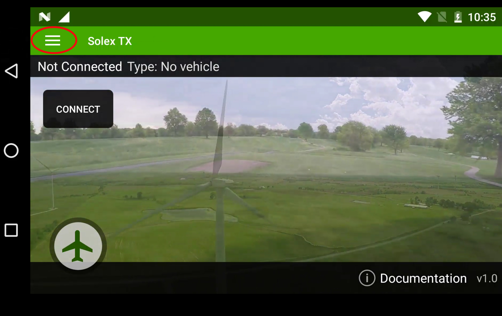
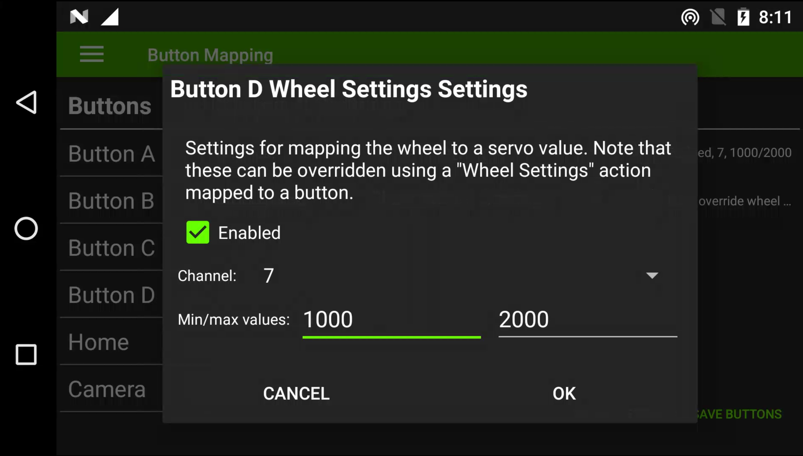

# Mode & Mavlink Buttons Configuration

Buttons A,B,C,D,Cam, Home & HW Wheel can be configured in Solex TX and QGC to Mavlink commands, these include

* Mode Selection 
* Arm/Disarm 
* Servo Output Control 
* Relay Control 
* HW Wheel Channel Mapping
* App Specific Commands

## Autopilot Mode Selection

Solet TX and QGC have on screen controls for selecting mode in Ardupilot and PX4, ie: selecting and changing flight modes such as loiter,stabilised. If you want to configure one or more buttons to change modes they must only be set to Mavlink button commands within Solex TX or QGC. 

Mavlink provides a safe command link for mode change and is not affected by system reboots and loss of signal. 

After configuring mode selection users should confirm their failsafe settings are correct and work as expected by testing before using the system. 

## Home Button 

The home button can only be configured with mavlink commands in Solex TX or QGC.  It is advised to set Homebutton Long Press to ‘RTL’ command. 

## Button Configuration

### **To Configure in Solex TX**

* Open Solex TX App 
* Click 3 line in top left corner

* Select 'Button Mapping' 

* Choose desired button

* Select either 'Click' or 'Long Click' \(**Note** this allows you to set two functions to each button\) 

* Click on drop down to select the function you want

* Click on small cog to select option with-in selected function  

* Select function option

* Repeat for each button assignment and click 'Save Buttons' in bottom corner to finish

### **To Configure in QGC**

* Open QGC
* Click the 3 cogs in top left corner

* Select 'Buttons' 
* Tick the box next to the desired button
* Click on drop down to select function
* Repeat for each button 

## Hardware Wheel

The hardware wheel is mapped to SBUS channel 5 by default but can also be configured in Solex TX to Servo output channels 1-16 on the Cube Autopilot, you also have the ability to switch the servo output via a button in Solex TX.

### **To Configure Wheel in Solex TX**

* Open Solex TX App 
* Click 3 line in top left corner
* Select 'Button Mapping' as above
* Click 'Wheel Settings' in the bottom corner

* Select the desired servo channel from 1- to 16

* Select the PWM output range for your application

* Click the 'Enabled' box to activate the output

* Finish by clicking OK and click 'Save Buttons' in bottom corner
* To configure a button to change the wheel servo output configure the button to 'Wheel Settings' 

* Click the cog and set new channel and PWM values and click OK and then 'Save Buttons' in bottom corner.  

Once changed the wheel will output on the new selected channel, to return to its original servo output you will need to program one button function to 'Clear Wheel Settings' as shown above.

